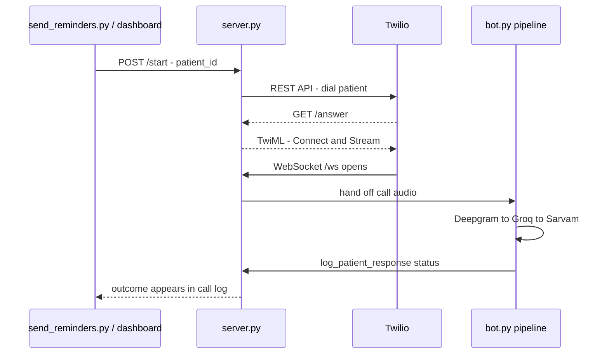

<div align="center">


### Every patient reminded, in their own language.

An outbound-calling voice agent that phones patients, reminds them of an upcoming
appointment, and captures a confirm, reschedule, or cancel — automatically, in
Hindi or English, detected mid-conversation.

[](https://python.org)
[](https://fastapi.tiangolo.com)
[](https://github.com/pipecat-ai/pipecat)
[](https://twilio.com)
[](https://render.com)

**[🌐 Live site](https://hospital-voice-agent-5qm9.onrender.com)** · **[📊 Dashboard](https://hospital-voice-agent-5qm9.onrender.com/app)** (password-protected)

</div>

---

## Contents

- [What this is](#what-this-is)
- [Stack](#stack)
- [How a call flows](#how-a-call-flows)
- [Project structure](#project-structure)
- [Getting started](#getting-started)
- [Consent & language handling](#consent--language-handling)
- [Deploying to Render](#deploying-to-render)
- [Costs & limits](#costs--limits-as-of-writing)
- [Roadmap](#roadmap)

## What this is

Front-desk staff calling every patient by hand doesn't scale, and no-shows are expensive.
This agent does the calling instead — a real outbound phone call (not a chat widget), built
on [Pipecat](https://github.com/pipecat-ai/pipecat) and adapted from Pipecat's official
[Twilio outbound-call example](https://github.com/pipecat-ai/pipecat-examples/tree/main/twilio-chatbot).

Every call:

- Opens with an explicit, fixed consent line — in English *and* Hindi
- Reminds the patient of their doctor, date, and time
- Detects whether the patient answers in Hindi, English, or a mix, and replies in kind
- Asks for and captures a clear confirm / reschedule / cancel outcome
- Logs that outcome automatically — no manual data entry

## Stack

| Stage | Service | Why |
|---|---|---|
| 📞 Telephony | [Twilio](https://twilio.com) | Dials the patient, streams call audio to us |
| 👂 Speech-to-text | [Deepgram](https://deepgram.com) (Nova-3, `multi` mode) | Free tier; code-switches between Hindi and English in real time |
| 🧠 LLM | [Groq](https://groq.com) (Llama 3.3 70B) | Genuine ongoing free tier, very fast |
| 🗣️ Text-to-speech | [Sarvam AI](https://sarvam.ai) (`bulbul:v2`) | Built specifically for Hindi/Indian-language speech; real speaker voices |
| ☁️ Hosting | [Render](https://render.com) | Free web-service tier, no card required |
| ✉️ Contact form | [Resend](https://resend.com) | Free tier email delivery for the landing page |

<details>
<summary><b>A note on "free"</b></summary>
<br>

Deepgram and Groq have real, ongoing free tiers used as-is here (see [Costs & limits](#costs--limits-as-of-writing)
for exact numbers). We originally tried ElevenLabs for TTS, but discovered its free tier blocks
*all* API access to voices (confirmed by testing, not just reading docs) — the web app is free,
the API isn't, even on a $0 plan. Sarvam AI replaced it; check their free-tier terms yourself at
signup, since this project hasn't been running long enough to confirm their exact limits.

Twilio is the one guaranteed non-free piece — making an actual phone call over the real
telephone network always costs something (a small amount to rent a phone number, plus a
per-minute rate), though new accounts get ~$15 in trial credit (no card required) that's enough
to test this project. We originally tried Plivo, but its signup flow rejected personal Gmail
addresses for this account, so we switched to Twilio, which accepts them.

</details>

## How a call flows



## Project structure

```
hospital-voice-agent/
├── bot.py                 # Pipecat pipeline for one call: STT → LLM → TTS
├── language_router.py     # Retunes Sarvam's TTS language mid-call to match the patient
├── server.py               # FastAPI app: Twilio webhooks, dashboard, contact form
├── call_log.py             # Appends confirm/reschedule/cancel outcomes to a CSV
├── patients.json           # Patient list (stand-in for a real database)
├── send_reminders.py       # CLI: trigger reminder calls for every patient
├── dashboard.html           # Password-protected ops dashboard (/app)
├── landing.html             # Public marketing page (/)
├── assets/                  # Logo marks (icon, badge, full lockup)
├── render.yaml               # Render Blueprint — one-click deploy config
├── requirements.txt
└── .env.example
```

## Getting started

### 1. Prerequisites

- Python 3.11+
- API keys: [Twilio](https://console.twilio.com), [Deepgram](https://console.deepgram.com),
  [Groq](https://console.groq.com), [Sarvam AI](https://sarvam.ai)
- A Twilio phone number that supports voice ([buy one here](https://console.twilio.com/us1/develop/phone-numbers/manage/search))
- [ngrok](https://ngrok.com) for local testing

### 2. Install

```bash
pip install -r requirements.txt
cp .env.example .env   # fill in every key
```

Edit `patients.json` — at minimum, put your own phone number in one entry so you can test
safely (`+91XXXXXXXXXX` format). Set `DASHBOARD_PASSWORD` in `.env` to anything of your choosing.

### 3. Run locally

```bash
python server.py
```

In a second terminal, expose it to the internet (Twilio can't call `localhost`):

```bash
ngrok http 7860
```

Put the `https://....ngrok-free.app` URL ngrok prints into `.env` as `SERVER_BASE_URL`.

### 4. Trigger a call

```bash
python send_reminders.py P001          # one patient
python send_reminders.py               # everyone in patients.json
```

or open the ngrok URL in a browser and log in with `DASHBOARD_USERNAME`/`DASHBOARD_PASSWORD` —
click **Call now** next to a patient instead.

Your phone rings. Answer it — you should hear the bilingual consent line, then the reminder,
then a question about confirming, rescheduling, or cancelling. Check `logs/call_log.csv`
(or the dashboard's Call Log table) for the recorded outcome afterward.

## Consent & language handling

- The bot's very first line, every call, is a **fixed, not LLM-improvised** consent statement
  in English and Hindi, built in `bot.py`'s `build_system_instruction()`. The system prompt
  instructs the LLM to say it "verbatim, and nothing else" — see [Roadmap](#roadmap) for a more
  bulletproof way to guarantee this.
- Deepgram's `language="multi"` mode transcribes Hindi/English code-switching and tags each
  transcript with the language it detected. Sarvam's TTS needs to be told explicitly which
  language to speak next (unlike ElevenLabs' auto-detecting model) — `language_router.py`
  watches the detected language on each transcript and pushes a `TTSUpdateSettingsFrame` to
  retune Sarvam whenever it changes, filtering out languages Sarvam doesn't actually support.

## Deploying to Render

1. Push this repo to GitHub (private is fine).
2. On [dashboard.render.com](https://dashboard.render.com): **New +** → **Blueprint** → connect
   this repo. Render reads `render.yaml` and configures the service automatically.
3. Fill in the prompted secrets (`TWILIO_ACCOUNT_SID`, `TWILIO_AUTH_TOKEN`,
   `TWILIO_PHONE_NUMBER`, `DEEPGRAM_API_KEY`, `SARVAM_API_KEY`, `GROQ_API_KEY`,
   `DASHBOARD_USERNAME`, `DASHBOARD_PASSWORD`, `RESEND_API_KEY`, `CONTACT_EMAIL_TO`) —
   into Render's dashboard, never into `render.yaml` or a committed `.env`.
4. Deploy. Render gives you a persistent URL — point `send_reminders.py` at it instead of ngrok.

<details>
<summary><b>Free-tier cold-start tradeoff</b></summary>
<br>

Render's free web services spin down after ~15 minutes of inactivity, with a ~1 minute
cold-start delay on the next request. This project's flow is naturally resilient to that:
`send_reminders.py`'s call to `/start` is itself the request that wakes the server, and it
happens *before* Twilio ever dials the patient — so by the time Twilio calls back to `/answer`
and opens the `/ws` WebSocket, the server is already warm. The VAD model is also pre-warmed at
server *boot*, not on the first call, since ONNX model loading on a throttled free CPU was slow
enough to make Twilio give up waiting mid-call otherwise.

</details>

## Costs & limits (as of writing)

| Service | Notes |
|---|---|
| Deepgram | Free tier credit for new accounts; Hindi/English code-switch quality can vary — test with real Hinglish phrases |
| Groq | Rate-limited (~30 req/min, 1,000 req/day on `llama-3.3-70b-versatile`), not credit-limited |
| Sarvam AI | Check current free-tier terms at signup — not independently verified for this project |
| Twilio | Not free — number rental + per-minute charges. ~$15 trial credit on signup, no card required |
| Render | Free web-service tier, no card required; spins down when idle |
| Resend | 100 emails/day free, no domain verification needed for testing |

## Roadmap

- [ ] **Guarantee the consent line word-for-word** — speak it via a `TTSSpeakFrame` pushed
      before the LLM ever runs, bypassing the LLM (and any risk of paraphrasing) for that one line
- [ ] **Real database** instead of `patients.json` / `call_log.csv` — `call_log.py` is already
      isolated, so this is a single-file swap
- [ ] **Retry logic** for no-answer / voicemail detection
- [ ] **Call recording & consent enforcement** — today the bot *states* the call may be
      recorded, but nothing enables Twilio recording or halts the call on refused consent
- [ ] **India-specific compliance** — outbound calling to patients may be subject to
      TRAI/DND-registry and DPDP Act rules; this project is a technical starting point, not
      legal compliance — check applicable regulations before calling real patients at scale

---

<div align="center">
<sub>Built for hospitals that don't want to miss a patient.</sub>
</div>
